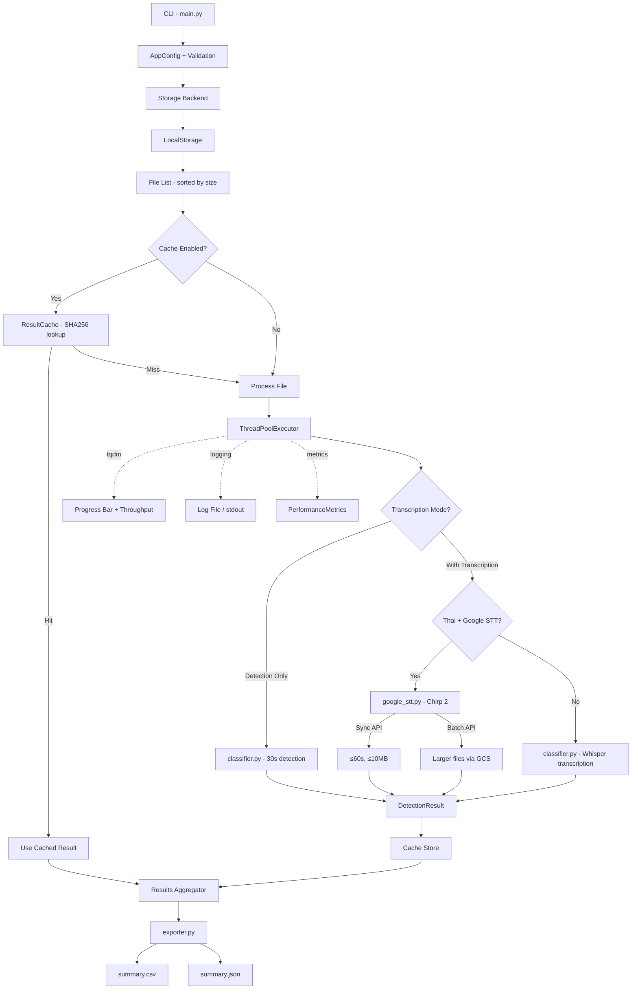

# ARCHITECTURE

## Overview

Audio Language Classifier & Summarizer — เครื่องมือ CLI สำหรับตรวจจับภาษาและถอดเสียงจากไฟล์เสียง รองรับการประมวลผลแบบ batch ด้วย faster-whisper (CTranslate2) และ Google Cloud Speech-to-Text v2 (Chirp 2) สำหรับภาษาไทย

## Goals

- ตรวจจับภาษาจากไฟล์เสียงอัตโนมัติ (อ่านเฉพาะ 30 วินาทีแรก)
- ถอดเสียงเป็นข้อความ (optional) ด้วย faster-whisper หรือ Google Chirp 2
- รองรับ Thai optimization ผ่าน Google STT fallback
- ประมวลผลแบบ batch ด้วย ThreadPoolExecutor
- แคชผลลัพธ์ด้วย SHA256 hashing + TTL เพื่อข้าม re-processing
- ส่งออกผลลัพธ์เป็น CSV + JSON
- รองรับ GPU (CUDA) และ CPU
- Docker support (GPU + CPU variants)

## Non-Goals

- Real-time audio streaming / live transcription
- Web UI / REST API server
- Speaker diarization (แยกผู้พูด)
- Audio editing / format conversion
- Cloud storage backend (GCS/MinIO/S3)
- Unit tests (มีแล้วใน `tests/`)

## Stack

| Layer | Technology |
|-------|-----------|
| Language | Python 3.11+ |
| Inference | faster-whisper (CTranslate2) |
| Thai STT | Google Cloud Speech-to-Text v2 (Chirp 2) |
| Concurrency | concurrent.futures.ThreadPoolExecutor |
| Progress | tqdm |
| Config | dataclass + argparse |
| Container | Docker (nvidia/cuda:12.1.1 / python:3.11-slim) |
| Audio Probe | ffprobe (FFmpeg) |

## Project Structure

```
audio_language_classifier/
├── main.py                  # CLI entry point & batch orchestration
├── config.py                # AppConfig dataclass with validation
├── classifier.py            # Language detection & transcription (faster-whisper)
├── google_stt.py            # Google Cloud STT v2 (Chirp 2) — sync + batch API
├── cache.py                 # SHA256-based result caching with TTL
├── performance.py           # Metrics tracking & timing utilities
├── exporter.py              # CSV + JSON export
├── constants.py             # All magic numbers, model strings, defaults
├── exceptions.py            # Custom exception hierarchy
├── utils.py                 # Helper functions (ffprobe, Google auth, validation)
├── storage/
│   ├── __init__.py          # Exports StorageBackend, LocalStorage
│   ├── base.py              # Abstract StorageBackend (ABC)
│   └── local.py             # Local filesystem implementation
├── requirements.txt
├── Dockerfile
├── README.md
├── CLAUDE.md                # Development guidelines
├── GEMINI.md                # Development guidelines (alt)
├── agent.md                 # AI agent context
├── docs/
│   ├── architecture.md      # This file
│   └── workflow.md          # AI workflow methodology
├── audio_files/             # Input audio (not tracked)
└── results/                 # Output (summary.csv, summary.json)
```

## Components

### 1. `main.py` — CLI Entry Point & Batch Orchestration

- `parse_args()` → สร้าง `AppConfig` จาก CLI arguments
- `setup_logging()` → ตั้งค่า logging (stdout + optional file)
- `process_files()` → ThreadPoolExecutor batch processor:
  - Sort files by size (small first) เพื่อ throughput optimization
  - ตรวจ cache ก่อนประมวลผล
  - tqdm progress bar พร้อม live throughput (files/sec)
  - Per-file timing tracking
- `main()` → Entry point: config validation → storage init → process → export

### 2. `config.py` — Configuration

- `AppConfig` dataclass (~20 fields) with `validate()` method
- Settings:
  - `input_path`, `output_dir`, `storage_type`
  - `model_size` (default: `base`), `device` (`auto`/`cpu`/`cuda`), `compute_type` (`int8`/`float16`/`float32`)
  - `max_duration` (default: 30s), `max_workers` (default: 4)
  - `enable_transcription`, `use_google_for_thai`
  - `audio_extensions`, `cache_dir`, `cache_ttl_hours` (default: 24h)
  - `log_level`, `log_file`, `enable_cache`, `show_timing`
- Validation: ตรวจ input path, device, compute type, worker count, Google credentials

### 3. `classifier.py` — Language Detection & Transcription

- `DetectionResult` dataclass: `file_name`, `detected_lang`, `probability`, `is_english`, `duration`, `transcription`, `transcription_source`
- `load_model()` → Singleton pattern (โหลดครั้งเดียว, แชร์ข้าม threads)
- `_detect_language_only()` → Quick detection จาก first segment (30s)
- `_transcribe_with_whisper()` → Two-pass transcription: pass 1 detect lang, pass 2 transcribe with lang hint + per-language params
- `_transcribe_thai_with_google()` → Fallback ไป Google Chirp 2 สำหรับภาษาไทย
- `detect_language()` → Main entry point พร้อม conditional flow
- Features: Adaptive beam sizes per model, language-aware VAD + anti-hallucination params (EN vs TH), error recovery

### 4. `google_stt.py` — Google Cloud STT v2 (Chirp 2)

- `get_stt_client()` / `get_storage_client()` → Singleton clients
- `_should_use_batch_api()` → Route: sync (≤60s, ≤10MB) vs batch (larger files)
- `_transcribe_with_sync_api()` → Sync API พร้อม retry (3 attempts, exponential backoff)
- `_transcribe_with_batch_api()` → Batch API: upload to GCS → poll → cleanup
- `transcribe_with_chirp()` → Main entry point พร้อม auto-routing
- Timeout: 300s สำหรับ batch operations

### 5. `cache.py` — Result Caching

- `ResultCache` class:
  - `get(file_path)` → Return cached result ถ้ายังไม่ expire
  - `set(file_path, result)` → Store พร้อม timestamp
  - `clear_expired()` / `clear_all()`
  - `get_stats()` → Entry count, total size, age range
- Cache key: SHA256 hash ของ file content (ตรวจจับ file changes)
- TTL: 24 ชั่วโมง (configurable)

### 6. `performance.py` — Metrics & Timing

- `PerformanceMetrics` dataclass: total/successful/failed files, durations, model load time, per-file timings, Google STT stats, peak memory
- `PerformanceTimer` context manager สำหรับ timing blocks
- `get_summary()` / `log_summary()` → Formatted performance report

### 7. `exporter.py` — Output

- `export_csv(results, output_dir)` → `summary.csv` (dynamic columns: with/without transcription)
- `export_json(results, output_dir)` → `summary.json` (UTF-8, indented)
- Columns: `file_name`, `detected_lang`, `probability`, `is_english`, `duration`, `transcription`, `transcription_source` (conditional)

### 8. `constants.py` — Centralized Configuration

- Audio: `SUPPORTED_AUDIO_EXTENSIONS`, `MAX_FILE_SIZE_MB`, `MAX_AUDIO_DURATION_SECONDS`
- Models: `DEFAULT_MODEL_SIZE`, standard Whisper sizes (tiny → large-v3-turbo/turbo)
- `ADAPTIVE_BEAM_SIZES`: per-model detection/transcription beam sizes
- VAD: threshold, min speech/silence duration (TH defaults + EN-specific overrides)
- Anti-hallucination: TH params (`repetition_penalty`, `no_repeat_ngram_size`, etc.) + EN-specific lenient params
- Google STT: retry count (3), delay, backoff
- Cache: default dir, TTL (24h)
- CSV: field names (with/without transcription)
- Language codes: `th`, `en`, `th-TH`

### 9. `exceptions.py` — Exception Hierarchy

```
AudioClassifierError (base)
├── ConfigurationError
├── StorageError
├── TranscriptionError
│   └── GoogleSTTError
├── FileSizeError
└── AudioProcessingError
```

### 10. `utils.py` — Helpers

- `get_google_project_id()` → Resolve from env or credentials JSON
- `check_file_size()` / `get_audio_duration()` → Validation via ffprobe
- `validate_file_for_processing()` → Size + duration constraints
- `ensure_directory_exists()`

### 11. `storage/` — Storage Abstraction

- `StorageBackend` (ABC): `list_audio_files()`, `get_local_path()`
- `LocalStorage`: Recursive rglob, case-insensitive extension matching
- Cloud backends (GCS/MinIO): Interface ready, ยังไม่ implement

## Flow



## Key Design Decisions

| Decision | Rationale |
|----------|-----------|
| `faster-whisper` over `whisper` | 4x faster, lower memory via CTranslate2 |
| Read only 30s for detection | Language detection ต้องการเสียงน้อย; ประหยัดเวลาและ memory |
| ThreadPoolExecutor over multiprocessing | Model โหลดครั้งเดียว; threads แชร์ model; เหมาะกับ I/O-bound + inference |
| Storage abstraction | เตรียมรับ GCS/MinIO โดยไม่ต้องแก้ core logic |
| `int8` compute type default | Performance ดีที่สุดบน CPU; เปลี่ยนเป็น `float16` สำหรับ GPU |
| Google Chirp 2 for Thai | Whisper อ่อนเรื่อง Thai; Chirp 2 แม่นกว่ามาก |
| Dual API strategy (sync/batch) | Sync ถูกกว่าสำหรับไฟล์เล็ก; batch จัดการไฟล์ใหญ่ได้ |
| SHA256 cache key | ตรวจจับ file content changes ได้แม่นกว่า path-based |
| Adaptive beam sizes | ปรับ beam size ตาม model size เพื่อ balance accuracy/speed |
| VAD filtering | กรอง silence ลด processing time |
| File size sorting | ไฟล์เล็กก่อน = throughput สม่ำเสมอกว่า |
| Two-pass transcription | Pass 1 detect lang (beam=1, fast) → Pass 2 transcribe with explicit lang hint; ป้องกัน Whisper เดาผิดภาษา |
| Language-aware params (EN vs TH) | TH: aggressive anti-hallucination; EN: lenient params เพราะ natural repetition และ pause ต่างกัน |
| Model cache volume mount | Mount `model_cache:/root/.cache/huggingface` เพื่อ reuse model ข้าม Docker run |

## Assumptions

- ผู้ใช้ติดตั้ง `ffmpeg`/`ffprobe` ในระบบ (หรือใช้ Docker)
- Audio files อยู่ใน formats ที่รองรับ: `.wav`, `.mp3`, `.flac`, `.ogg`, `.m4a`
- สำหรับ Google STT: ต้องมี `GOOGLE_APPLICATION_CREDENTIALS` และ GCS bucket (สำหรับ batch API)
- GPU mode ต้องมี NVIDIA GPU + CUDA drivers
- ไฟล์เสียงไม่เกิน 500MB (configurable)
- Single machine deployment (ไม่มี distributed processing)
